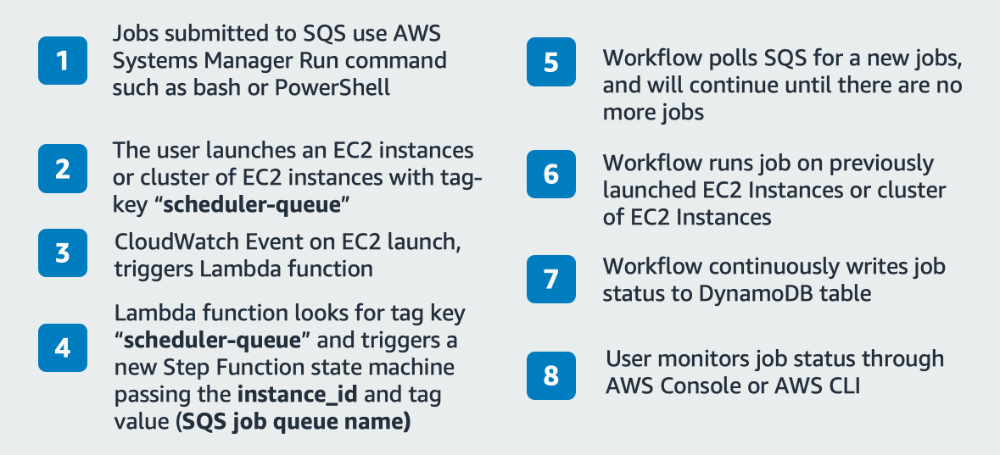
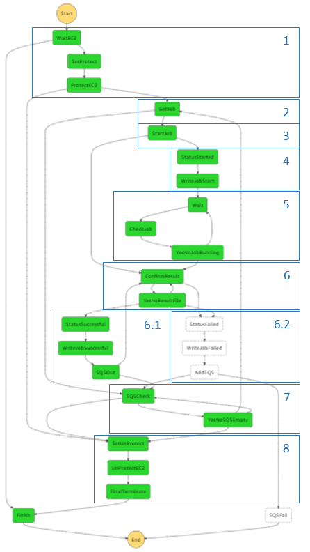

Please refer to Deployment section below for full instructions on deploying & testing
=====================================================================================

<!DOCTYPE html>
<html lang="en">
  <head>
  </head>
  <body>
    <table>
      <tr>
        <th>Region</th>
        <th>serverless-scheduler-app.template</th>
        <th>resource-management.template</th>
      </tr>
      <tr>
        <th>eu-north-1</th>
        <td>
          <a href="https://console.aws.amazon.com/cloudformation/home?region=eu-north-1#/stacks/new?stackName=serverless-scheduler-app&templateURL=https://s3.amazonaws.com/solution-builders-eu-north-1/aws-decoupled-serverless-scheduler/latest/serverless-scheduler-app.template">
            
          </a>
        </td>
        <td>
          <a href="https://console.aws.amazon.com/cloudformation/home?region=eu-north-1#/stacks/new?stackName=resource-management&templateURL=https://s3.amazonaws.com/solution-builders-eu-north-1/aws-decoupled-serverless-scheduler/latest/resource-management.template">
            
          </a>
        </td>
      </tr>
      <tr>
        <th>ap-south-1</th>
        <td>
          <a href="https://console.aws.amazon.com/cloudformation/home?region=ap-south-1#/stacks/new?stackName=serverless-scheduler-app&templateURL=https://s3.amazonaws.com/solution-builders-ap-south-1/aws-decoupled-serverless-scheduler/latest/serverless-scheduler-app.template">
            
          </a>
        </td>
        <td>
          <a href="https://console.aws.amazon.com/cloudformation/home?region=ap-south-1#/stacks/new?stackName=resource-management&templateURL=https://s3.amazonaws.com/solution-builders-ap-south-1/aws-decoupled-serverless-scheduler/latest/resource-management.template">
            
          </a>
        </td>
      </tr>
      <tr>
        <th>eu-west-3</th>
        <td>
          <a href="https://console.aws.amazon.com/cloudformation/home?region=eu-west-3#/stacks/new?stackName=serverless-scheduler-app&templateURL=https://s3.amazonaws.com/solution-builders-eu-west-3/aws-decoupled-serverless-scheduler/latest/serverless-scheduler-app.template">
            
          </a>
        </td>
        <td>
          <a href="https://console.aws.amazon.com/cloudformation/home?region=eu-west-3#/stacks/new?stackName=resource-management&templateURL=https://s3.amazonaws.com/solution-builders-eu-west-3/aws-decoupled-serverless-scheduler/latest/resource-management.template">
            
          </a>
        </td>
      </tr>
      <tr>
        <th>eu-west-2</th>
        <td>
          <a href="https://console.aws.amazon.com/cloudformation/home?region=eu-west-2#/stacks/new?stackName=serverless-scheduler-app&templateURL=https://s3.amazonaws.com/solution-builders-eu-west-2/aws-decoupled-serverless-scheduler/latest/serverless-scheduler-app.template">
            
          </a>
        </td>
        <td>
          <a href="https://console.aws.amazon.com/cloudformation/home?region=eu-west-2#/stacks/new?stackName=resource-management&templateURL=https://s3.amazonaws.com/solution-builders-eu-west-2/aws-decoupled-serverless-scheduler/latest/resource-management.template">
            
          </a>
        </td>
      </tr>
      <tr>
        <th>eu-west-1</th>
        <td>
          <a href="https://console.aws.amazon.com/cloudformation/home?region=eu-west-1#/stacks/new?stackName=serverless-scheduler-app&templateURL=https://s3.amazonaws.com/solution-builders-eu-west-1/aws-decoupled-serverless-scheduler/latest/serverless-scheduler-app.template">
            
          </a>
        </td>
        <td>
          <a href="https://console.aws.amazon.com/cloudformation/home?region=eu-west-1#/stacks/new?stackName=resource-management&templateURL=https://s3.amazonaws.com/solution-builders-eu-west-1/aws-decoupled-serverless-scheduler/latest/resource-management.template">
            
          </a>
        </td>
      </tr>
      <tr>
        <th>ap-northeast-3</th>
        <td>
          <a href="https://console.aws.amazon.com/cloudformation/home?region=ap-northeast-3#/stacks/new?stackName=serverless-scheduler-app&templateURL=https://s3.amazonaws.com/solution-builders-ap-northeast-3/aws-decoupled-serverless-scheduler/latest/serverless-scheduler-app.template">
            
          </a>
        </td>
        <td>
          <a href="https://console.aws.amazon.com/cloudformation/home?region=ap-northeast-3#/stacks/new?stackName=resource-management&templateURL=https://s3.amazonaws.com/solution-builders-ap-northeast-3/aws-decoupled-serverless-scheduler/latest/resource-management.template">
            
          </a>
        </td>
      </tr>
      <tr>
        <th>ap-northeast-2</th>
        <td>
          <a href="https://console.aws.amazon.com/cloudformation/home?region=ap-northeast-2#/stacks/new?stackName=serverless-scheduler-app&templateURL=https://s3.amazonaws.com/solution-builders-ap-northeast-2/aws-decoupled-serverless-scheduler/latest/serverless-scheduler-app.template">
            
          </a>
        </td>
        <td>
          <a href="https://console.aws.amazon.com/cloudformation/home?region=ap-northeast-2#/stacks/new?stackName=resource-management&templateURL=https://s3.amazonaws.com/solution-builders-ap-northeast-2/aws-decoupled-serverless-scheduler/latest/resource-management.template">
            
          </a>
        </td>
      </tr>
      <tr>
        <th>ap-northeast-1</th>
        <td>
          <a href="https://console.aws.amazon.com/cloudformation/home?region=ap-northeast-1#/stacks/new?stackName=serverless-scheduler-app&templateURL=https://s3.amazonaws.com/solution-builders-ap-northeast-1/aws-decoupled-serverless-scheduler/latest/serverless-scheduler-app.template">
            
          </a>
        </td>
        <td>
          <a href="https://console.aws.amazon.com/cloudformation/home?region=ap-northeast-1#/stacks/new?stackName=resource-management&templateURL=https://s3.amazonaws.com/solution-builders-ap-northeast-1/aws-decoupled-serverless-scheduler/latest/resource-management.template">
            
          </a>
        </td>
      </tr>
      <tr>
        <th>sa-east-1</th>
        <td>
          <a href="https://console.aws.amazon.com/cloudformation/home?region=sa-east-1#/stacks/new?stackName=serverless-scheduler-app&templateURL=https://s3.amazonaws.com/solution-builders-sa-east-1/aws-decoupled-serverless-scheduler/latest/serverless-scheduler-app.template">
            
          </a>
        </td>
        <td>
          <a href="https://console.aws.amazon.com/cloudformation/home?region=sa-east-1#/stacks/new?stackName=resource-management&templateURL=https://s3.amazonaws.com/solution-builders-sa-east-1/aws-decoupled-serverless-scheduler/latest/resource-management.template">
            
          </a>
        </td>
      </tr>
      <tr>
        <th>ca-central-1</th>
        <td>
          <a href="https://console.aws.amazon.com/cloudformation/home?region=ca-central-1#/stacks/new?stackName=serverless-scheduler-app&templateURL=https://s3.amazonaws.com/solution-builders-ca-central-1/aws-decoupled-serverless-scheduler/latest/serverless-scheduler-app.template">
            
          </a>
        </td>
        <td>
          <a href="https://console.aws.amazon.com/cloudformation/home?region=ca-central-1#/stacks/new?stackName=resource-management&templateURL=https://s3.amazonaws.com/solution-builders-ca-central-1/aws-decoupled-serverless-scheduler/latest/resource-management.template">
            
          </a>
        </td>
      </tr>
      <tr>
        <th>ap-southeast-1</th>
        <td>
          <a href="https://console.aws.amazon.com/cloudformation/home?region=ap-southeast-1#/stacks/new?stackName=serverless-scheduler-app&templateURL=https://s3.amazonaws.com/solution-builders-ap-southeast-1/aws-decoupled-serverless-scheduler/latest/serverless-scheduler-app.template">
            
          </a>
        </td>
        <td>
          <a href="https://console.aws.amazon.com/cloudformation/home?region=ap-southeast-1#/stacks/new?stackName=resource-management&templateURL=https://s3.amazonaws.com/solution-builders-ap-southeast-1/aws-decoupled-serverless-scheduler/latest/resource-management.template">
            
          </a>
        </td>
      </tr>
      <tr>
        <th>ap-southeast-2</th>
        <td>
          <a href="https://console.aws.amazon.com/cloudformation/home?region=ap-southeast-2#/stacks/new?stackName=serverless-scheduler-app&templateURL=https://s3.amazonaws.com/solution-builders-ap-southeast-2/aws-decoupled-serverless-scheduler/latest/serverless-scheduler-app.template">
            
          </a>
        </td>
        <td>
          <a href="https://console.aws.amazon.com/cloudformation/home?region=ap-southeast-2#/stacks/new?stackName=resource-management&templateURL=https://s3.amazonaws.com/solution-builders-ap-southeast-2/aws-decoupled-serverless-scheduler/latest/resource-management.template">
            
          </a>
        </td>
      </tr>
      <tr>
        <th>eu-central-1</th>
        <td>
          <a href="https://console.aws.amazon.com/cloudformation/home?region=eu-central-1#/stacks/new?stackName=serverless-scheduler-app&templateURL=https://s3.amazonaws.com/solution-builders-eu-central-1/aws-decoupled-serverless-scheduler/latest/serverless-scheduler-app.template">
            
          </a>
        </td>
        <td>
          <a href="https://console.aws.amazon.com/cloudformation/home?region=eu-central-1#/stacks/new?stackName=resource-management&templateURL=https://s3.amazonaws.com/solution-builders-eu-central-1/aws-decoupled-serverless-scheduler/latest/resource-management.template">
            
          </a>
        </td>
      </tr>
      <tr>
        <th>us-east-1</th>
        <td>
          <a href="https://console.aws.amazon.com/cloudformation/home?region=us-east-1#/stacks/new?stackName=serverless-scheduler-app&templateURL=https://s3.amazonaws.com/solution-builders-us-east-1/aws-decoupled-serverless-scheduler/latest/serverless-scheduler-app.template">
            
          </a>
        </td>
        <td>
          <a href="https://console.aws.amazon.com/cloudformation/home?region=us-east-1#/stacks/new?stackName=resource-management&templateURL=https://s3.amazonaws.com/solution-builders-us-east-1/aws-decoupled-serverless-scheduler/latest/resource-management.template">
            
          </a>
        </td>
      </tr>
      <tr>
        <th>us-east-2</th>
        <td>
          <a href="https://console.aws.amazon.com/cloudformation/home?region=us-east-2#/stacks/new?stackName=serverless-scheduler-app&templateURL=https://s3.amazonaws.com/solution-builders-us-east-2/aws-decoupled-serverless-scheduler/latest/serverless-scheduler-app.template">
            
          </a>
        </td>
        <td>
          <a href="https://console.aws.amazon.com/cloudformation/home?region=us-east-2#/stacks/new?stackName=resource-management&templateURL=https://s3.amazonaws.com/solution-builders-us-east-2/aws-decoupled-serverless-scheduler/latest/resource-management.template">
            
          </a>
        </td>
      </tr>
      <tr>
        <th>us-west-1</th>
        <td>
          <a href="https://console.aws.amazon.com/cloudformation/home?region=us-west-1#/stacks/new?stackName=serverless-scheduler-app&templateURL=https://s3.amazonaws.com/solution-builders-us-west-1/aws-decoupled-serverless-scheduler/latest/serverless-scheduler-app.template">
            
          </a>
        </td>
        <td>
          <a href="https://console.aws.amazon.com/cloudformation/home?region=us-west-1#/stacks/new?stackName=resource-management&templateURL=https://s3.amazonaws.com/solution-builders-us-west-1/aws-decoupled-serverless-scheduler/latest/resource-management.template">
            
          </a>
        </td>
      </tr>
      <tr>
        <th>us-west-2</th>
        <td>
          <a href="https://console.aws.amazon.com/cloudformation/home?region=us-west-2#/stacks/new?stackName=serverless-scheduler-app&templateURL=https://s3.amazonaws.com/solution-builders-us-west-2/aws-decoupled-serverless-scheduler/latest/serverless-scheduler-app.template">
            
          </a>
        </td>
        <td>
          <a href="https://console.aws.amazon.com/cloudformation/home?region=us-west-2#/stacks/new?stackName=resource-management&templateURL=https://s3.amazonaws.com/solution-builders-us-west-2/aws-decoupled-serverless-scheduler/latest/resource-management.template">
            
          </a>
        </td>
      </tr>
    </table>
    <p class="footer">Generated by cfn-publish on Wed Nov 27 16:42:56 UTC 2019</p>
  </body>
</html>


Decoupled Serverless Scheduler To Run HPC Applications At Scale on EC2
======================================================================

In this blog post, we dive in to a cloud native approach for running HPC
applications at scale on EC2 Spot Instances, using a decoupled
serverless scheduler. This architecture is ideal for many workloads in
the HPC and EDA industries, and can be used for any batch job workload.
An example of this application is running IP Characterization on AWS,
where the fault tolerant nature of IP Characterization tools allows for
this architecture to be used effectively.

At the end of this blog post, you will have two things.

1.  A highly scalable environment that can run on hundreds of thousands
    of cores across EC2 Spot Instances.

2.  A fully serverless architecture for job orchestration.

We discuss deploying and running a pre-built serverless job scheduler
that can run both Windows and Linux applications using any executable
file format for your application. This cloud native environment provides
high performance, scalability, cost efficiency, and fault tolerance. We
introduce best practices and benefits to creating this environment, and
cover the architecture, running jobs, and integration in to existing
environments.

A quick note about the term cloud native: Cloud native can mean a
container-based environment, but here we use the term more loosely. In
this blog, the term means we are not replicating an on-premises
environment by using a lift-and-shift method. Instead of lift-and-shift,
we use AWS Services (to include serverless and microservices) to build
out our compute environment.

Let\'s get started!

Solution overview 
==================

This guide goes over the deployment process, which leverages AWS
CloudFormation. This allows you to use infrastructure as code to
automatically build out your environment. There are two parts to the
solution: the Serverless Scheduler and Resource Automation. Below are
quick summaries of each part of the solutions.

**Part 1 - The Serverless Scheduler** 
--------------------------------------

This first part of the blog builds out a serverless workflow to get jobs
from SQS and run them across EC2 instances. In Part 2, we build an
environment that uses AWS Auto Scaling to dynamically expand and
contract your compute environment as needed, as well as simplify the job
submission process. The CloudFormation template being used for Part 1 is
serverless-scheduler-app.template, and here is the Reference
Architecture:




Figure 1: Serverless Scheduler Reference Architecture (grayed-out area
is covered in Part 2).


**Part 2 - Resource Automation with Serverless Scheduler** 
-----------------------------------------------------------

This part of the solution relies on the serverless scheduler built in
Part 1 to run jobs on EC2. Part 2 makes it simple for users to submit
and monitor jobs, and retrieve results. Jobs will be spread across [Spot
Instances](https://aws.amazon.com/ec2/spot/). These instances offer up
to 90% cost reduction compared to On-Demand Instances. AWS Autoscaling
automatically scales up compute resources when jobs are submitted, then
terminates them when jobs are finished. The CloudFormation template used
in Part 2 is resource-automation.template. Building on the Serverless
Scheduler Reference Architecture, the additional resources launched with
Part 2 are noted in the following image, they are an S3 Bucket, AWS
Autoscaling Group and finally two Lambda functions.


Figure 2: Resource Automation using Serverless Scheduler

Introduction to decoupled serverless scheduling
===============================================

HPC schedulers traditionally run in a classic master and worker node
configuration. A scheduler on the master node orchestrates jobs on
worker nodes. This design has proven successful for decades across
numerous industries. Many powerful schedulers have evolved to meet the
challenging demands of HPC workloads. This scheduler design evolved from
a necessity to run orchestration logic on one machine, but there are now
options to decouple this logic.

What are the possible benefits that decoupling this logic could bring?
First, we avoid a number of shortfalls in the environment such as the
need for all worker nodes to communicate with a single master node. This
inherently limits scalability and also creates a single point of
failure. When we split the scheduler into decoupled components both
these issues disappear. Traditional schedulers have had to work around
this with clever software engineering. They include complex logic to
manage all workers concurrently in a single application. The code is
often so complex, it makes customization and continues improvement only
possible through the software provider\'s engineering teams.

Serverless services, such as [AWS Step
Functions](https://aws.amazon.com/step-functions/) and [AWS
Lambda](https://aws.amazon.com/lambda/), allow you to decouple the
scheduling logic to have a one-to-one mapping with each worker, and
instead share an [Amazon Simple Queue Service
(SQS)](https://aws.amazon.com/sqs/) job queue. We define our scheduling
workflow in [AWS Step
Functions](https://aws.amazon.com/step-functions/). Then the workflow
scales out to potentially thousands of "state machines." These state
machines act as wrappers around each worker node and manage each worker
node individually. Complexity in our code is lower because we only
consider one worker and what it should do.

We illustrate the differences between a traditional shared scheduler and
decoupled serverless scheduler in Figures 3 and 4.


Figure 3: Traditional Scheduler Model


Figure 4: Decoupled Serverless Scheduler on each instance

Each decoupled serverless scheduler will:

-   Retrieve and pass jobs to its worker

-   Monitor its workers health and take action if needed

-   Confirm job success by checking output logs and retry jobs if needed

-   Terminate the worker when job queue is empty just before also
    terminating itself

With this new scheduler model, there are many benefits. By decoupling
the schedulers into many smaller schedulers fault tolerance increases.
This is because any issue will only affect one worker. Adding to that
each scheduler consists of independent AWS Lambda functions where state
is maintained on separate hardware and retry logic is built into the
service. Scalability also increases, because jobs are no longer
dependent on a master node, allowing jobs to be distributed across
geographic regions. This geographic distribution allows you to make
better use of low-cost Spot Instances. Also when decoupling the
scheduler, workflow complexity decreases and developers can now
customize scheduler logic. They can leverage lower latency job
monitoring and customize automated responses to job events as they
happen.

Benefits
--------

-   **Fully managed** -- All components of the scheduler are serverless,
    which means no servers to spin up or manage, and no incurred cost if
    you are not submitting jobs. With Part 2- Resource Automation also
    deployed, if a job is submitted, resources will launch and run the
    job. When the job is done, worker nodes automatically shut down so
    that you do not incur continuous costs.

-   **Performance** -- Your application runs on Amazon EC2 and you can
    choose any of the AWS high performance instance types ([EC2 Instance
    Types](https://aws.amazon.com/ec2/instance-types/)). Input files are
    automatically copied from [Amazon S3](https://aws.amazon.com/s3/)
    into local [Amazon EC2 Instance
    Store](https://docs.aws.amazon.com/AWSEC2/latest/UserGuide/InstanceStorage.html)
    for high performance storage during execution. Result files are
    automatically moved to S3 after each job finishes.

-   **Scalability** -- A worker node combined with a scheduler state
    machine together become a stateless entity. You can spin up as many
    of these entities as you want and point them to an SQS queue. You
    can even distribute worker and state machine pairs across multiple
    AWS regions. The highly scalable and fully managed services used in
    this architecture will scale to meet your desired number of workers.

-   **Fault Tolerance** --The solution is completely decoupled, which
    means each worker has its own state machine that handles scheduling
    for that worker. Likewise, each state machine is decoupled into
    Lambda functions that make up your state machine. Adding to this,
    the scheduler workflow includes a Lambda function that confirms each
    successful job or jobs are resubmitted.

-   **Cost Efficiency** -- Using EC2 Spot Instances mean you can save up
    to 90% on your workloads compared to On-Demand Instance pricing. To
    use EC2 Spot, specify multiple instance types to use, and AWS Auto
    Scaling will automatically choose the cheapest Spot Instance
    available at a given time. The scheduler workflow ensures little to
    no idle time of workers by closely monitoring and sending new jobs
    as jobs finish. Because the scheduler is serverless, you only incur
    costs for the resources required to launch and run jobs. Once the
    job is complete, all are terminated automatically.

-   **Agility** - You can use AWS fully managed [Developer
    Tools](https://aws.amazon.com/products/developer-tools/) to quickly
    release changes and customize workflows. The reduced complexity of a
    decoupled scheduling workflow means that you don't have to spend
    time managing a scheduling environment, and can instead focus on
    your applications.

Part 1 - serverless scheduler as a standalone solution
======================================================

If you use the serverless scheduler as a standalone solution, you can
build clusters and leverage shared storage such as [FSx for
Lustre](https://aws.amazon.com/fsx/lustre/),
[EFS](https://aws.amazon.com/efs/), or [S3](https://aws.amazon.com/s3/).
Additionally, you can use [AWS
CloudFormation](https://aws.amazon.com/cloudformation/) or
[Terraform](https://www.terraform.io/) to deploy more complex compute
architectures that suit your use case. In other words, the EC2 Instances
that use the Part 1 - serverless scheduler can be launched in any number
of ways, all the scheduler requires is the instance id and the SQS job
queue name.

In Part 2 of this guide, you deploy an example compute resource and job
submitting mechanism. This deployment shows how you can simplify your
workflow with automation, and leverage Spot Instances to drastically
reduce compute costs.

Submitting Jobs Directly to serverless scheduler
------------------------------------------------

The serverless scheduler app is a fully built [AWS Step
Functions](https://aws.amazon.com/step-functions/) workflow to pull jobs
from an SQS queue and run them on an EC2 Instance. The jobs submitted to
SQS consist of an [AWS Systems Manager Run
Command](https://aws.amazon.com/systems-manager/features/), and work
with any [SSM
Document](https://docs.aws.amazon.com/systems-manager/latest/userguide/sysman-ssm-docs.html)
and command that you chose for your jobs. Examples of SSM Run Commands
are
[ShellScript](https://docs.aws.amazon.com/systems-manager/latest/userguide/run-command.html)
and
[PowerShell](https://docs.aws.amazon.com/systems-manager/latest/userguide/walkthrough-powershell.html).
You can read more on SSM Run Commands on [Running Commands Using Systems
Manager Run
Command](https://docs.aws.amazon.com/systems-manager/latest/userguide/execute-remote-commands.html).

The format of a job submitted to SQS is in JSON, and can be seen in the
example below:
```
{

    "job_id": "jobId_0",

    "retry": "3",

    "job_success_string": " ",

    "ssm_document": "AWS-RunPowerShellScript",

    "commands":

        [

            "cd C:\\ProgramData\\Amazon\\SSM",

            "Copy-S3object -Bucket my-bucket -KeyPrefix jobs/date/jobId_0
            -LocalFolder .\\\\\",

            "C:\\ProgramData\\Amazon\\SSM\\jobId_0.bat",

            "Write-S3object -Bucket my-bucket -KeyPrefix jobs/date/jobId_0
            --Folder .\\"

        ],

}
```

Any EC2 Instance that has a serverless scheduler associated with it
receives jobs picked up from a designated SQS queue until the queue is
empty. After that, the EC2 resource automatically terminates. If the job
fails, it retries until it reaches the number of times you specified in
the job definition. You can include a specific string value you want the
scheduler to search for in the job execution output, in order to confirm
a job has actually completed successfully.

Tagging EC2 Workers to Get a Serverless Scheduler App state machine
---------------------------------------------------------------

In Part 1 of the deployment, you must manage your EC2 Instance launch
and termination. When you launch an EC2 Instance, you tag it with a
specific tag key which triggers a state machine to manage that instance.
The tag value is the name of the SQS queue that you want your state
machine to poll jobs from.

In the following example tag, \"my-scheduler-cloudformation-stack-name\"
is the tag key the serverless scheduler app will for with any new EC2
instance that starts. Next, \"my-sqs-job-queue-name\" is the default job
queue created with the scheduler. But, you can change this to any queue
name you want to retrieve jobs from when an instance is launched.

{\"my-scheduler-cloudformation-stack-name\":\"my-sqs-job-queue-name\"}

Monitor jobs in DynamoDB
------------------------

You can monitor job status via the DynamoDB table as shown below. In the
table you can find **job_id**, commands sent to Amazon EC2, job status,
job output logs from Amazon EC2 and retries among other things.


Alternatively, users can query DynamoDB for a given job\_id via the [AWS
Command Line Interface](https://aws.amazon.com/cli/):

```
aws dynamodb get-item --table-name job-monitoring --key '{"job_id": {"S": "/my-jobs/my-job-id.bat"}}'
```

How to Use "job_success_string" Parameter
-----------------------------------------

For the prior DynamoDB table, we submitted two identical jobs using an
example script that you can also use. The command sent to the instance
is **"echo Hello World"** where the output from this job should be
**"Hello World."** I also specified three allowed job retries. In the
following image, there are two jobs in SQS queue before they ran. Look
closely at the different **"job_success_strings"** for each and the
identical command sent to both:


We see in the DynamodDB table that Job2 was successful and Job1 retried
three times before permanently labelled as failed. We purposely forced
this to demonstrate how the job success string works by submitting Job1
with \"job\_success\_string\" as \"Hello EVERYONE\", as that will not be
in the job output "Hello World". In "Job2" I set
\"job\_success\_string\" as \"Hello\" because we know this string will
be in the output log.

Job outputs commonly have text that only appears if job did what it was
supposed to do. You can also add this text yourself in your executable
file. With "job\_success\_string" you can be confident a successful job
was indeed successful or use it to identify a certain value you are
looking for across many jobs.

Part 2 - Resource Automation with the serverless scheduler
==========================================================

The additional services we deploy in Part 2 integrate with existing
architectures to launch resources for your serverless scheduler. We
deploy additional services that allow you to submit jobs simply by
uploading input files and executable files to an S3 bucket.

Likewise, these additional resources can use any executable file format
you want, including proprietary application level scripts. The solution
automates everything else. This includes creating and submitting jobs to
SQS job queue, spinning up compute resources when new jobs come in, and
taking them back down when there are no jobs to run. When jobs are done,
result files are copied to S3 for the user to retrieve. Similar to Part
1, you can still view the DynamoDB table for job status.

This architecture makes it easy to scale out to different teams and
departments, and you can submit potentially hundreds of thousands of
jobs while you remain in control of resources and cost.

Deeper Look at the S3 Architecture
----------------------------------

The following diagram shows how users can submit jobs, monitor progress
and retrieve results. To submit jobs all you do is upload all needed
input files and an executable script to S3. **The suffix of the
executable file (uploaded last) triggers an S3 event to start the
process, and this suffix is configurable.**

The S3 key of the executable file acts as the job id and is kept as a
reference to that job in DynamoDB. The Lambda (\#2 in diagram below)
uses the S3 key of the executable to create three SSM Run Commands.

1.  Synchronize all files in the same S3 folder to a working directory
    on the EC2 Instance.

2.  Run the executable file on EC2 Instances within a specified working
    directory

3.  Finally synchronize the EC2 Instance working directory back to the
    S3 bucket where newly generated result files are included, these
    will be result files.

This Lambda (\#2) then places the job on the SQS queue using the
schedulers JSON formatted job definition seen above.

*IMPORTANT: Each set of job files should be given a unique job folder in
S3 or more files than needed might be moved to the EC2 Instance.*


Figure 5: Resource Automation using Serverless Scheduler - A deeper look

Using both the Lambda function (\#3 in diagram above) and the Auto
Scaling Group, Amazon EC2 and AWS Step Functions workflow will scale out
based on how many jobs are in the job queue to a desired maximum number
of workers (plus state machine) defined in the Auto Scaling Group. When
the job queue is empty the number of running instances will
progressively scale down to 0 as they finish their remaining jobs.

Process Submitting Jobs and Retrieving Results
----------------------------------------------

1.  Seen as step 1, you upload input file(s) and an executable file into
    a unique job folder in S3 (such as
    /year/month/day/jobid/\~job-files). You upload the executable file
    last because this automatically starts the job. You can also use a
    script to upload multiple files at a time but each job will need a
    unique directory. There are many ways to make S3 buckets available
    to users including [AWS Storage
    Gateway](https://aws.amazon.com/storagegateway/),
    [AWS Transfer for
    SFTP](https://aws.amazon.com/sftp/),
    [AWS
    DataSync](https://aws.amazon.com/datasync/),
    the AWS Console or any one of the [AWS
    SDKs](https://aws.amazon.com/tools/) leveraging S3 API calls.

2.  You can monitor job status by accessing the DynamoDB table directly
    via the AWS Management Console or use the AWS CLI to call DynamoDB
    via an API call.

3.  Seen as step 5, you can retrieve result files for their jobs from
    the same S3 directory where you left the input files. You know jobs
    are done by monitoring DynamoDB table. The SQS output queue can also
    be used by applications that must automatically poll and retrieve
    results.

You no longer need to create or access compute nodes as compute
resources. These automatically scale up from zero when jobs come in, and
then back down to zero when jobs are finished.

Deeper Look at Serverless Scheduler Workflow
--------------------------------------------


1.  For a new EC2 instance with tag-key "my-scheduler-cloudformation-stack-name" Lambda starts a
    state machine and passes it the instnace id and SQS queue job name
    (#4 in previous architecture). The workflow waits for instance to
    be ready to start running jobs. If something fails, this step goes
    to step 8 and terminates instance.

2.  Workflow polls SQS job queue for new job. Message contains job_id,
    number of retries, optional success string to look for in job output
    logs and finally the SSM document type and commands to run/trigger
    that job on EC2.

3.  Using SSM Run Command, the job is passed to EC2 instance.

4.  Job start is written to DynamoDB

5.  Here the workflow will wait for commands to finish by polling SSM
    Run command for status.

6.  This step looks for a specific string in the job execution output to
    confirm the job ran successfully. You can leave it as blank to
    confirm any output. If job success is confirmed, workflow moves to
    step 6.1, if not flow moves to 6.2. Job status is written to
    DynamoDB. Finished job is then added to SQS Finished Job queue as
    potential on-premise system integration point to retrive results. If
    failed, job gets added back to job queue to run again if there are
    retry attempts remaining. A job will retry the number of times you
    specify in job definition.

7.  This steps checks if there are any jobs left in the job input queue.
    If there are more jobs then workflow goes back up to step 2 to start
    a new job and run steps 2 -- 6 again. Else, workflow moves to
    step 8.

8.  This step is reached if all job queue is empty or if there was an
    issue with the EC2 instance. First scale-in protection is removed in
    the EC2 Autoscaling Group if Autoscaling is in use. After that the
    workflow will terminate the instance automatically so users don't
    need to worry about idle instances.

Deployment
==========

Deploy Part 1: the serverless scheduler Using CloudFormation Template
---------------------------------------------------------------------

You now have an understanding of how the Serverless Scheduler works, and
how to enable automation and Auto Scaling with this service. So, let's
launch the environments.

Click to deploy CloudFormation template in AWS Region of choice:
<!DOCTYPE html>
<html lang="en">
  <head>
  </head>
  <body>
    <table>
      <tr>
        <th>Region</th>
        <th>serverless-scheduler-app.template</th>
      </tr>
      <tr>
        <th>eu-north-1</th>
        <td>
          <a href="https://console.aws.amazon.com/cloudformation/home?region=eu-north-1#/stacks/new?stackName=serverless-scheduler-app&templateURL=https://s3.amazonaws.com/solution-builders-eu-north-1/aws-decoupled-serverless-scheduler/latest/serverless-scheduler-app.template">
            
          </a>
        </td>
      </tr>
      <tr>
        <th>ap-south-1</th>
        <td>
          <a href="https://console.aws.amazon.com/cloudformation/home?region=ap-south-1#/stacks/new?stackName=serverless-scheduler-app&templateURL=https://s3.amazonaws.com/solution-builders-ap-south-1/aws-decoupled-serverless-scheduler/latest/serverless-scheduler-app.template">
            
          </a>
        </td>
      </tr>
      <tr>
        <th>eu-west-3</th>
        <td>
          <a href="https://console.aws.amazon.com/cloudformation/home?region=eu-west-3#/stacks/new?stackName=serverless-scheduler-app&templateURL=https://s3.amazonaws.com/solution-builders-eu-west-3/aws-decoupled-serverless-scheduler/latest/serverless-scheduler-app.template">
            
          </a>
        </td>
      </tr>
      <tr>
        <th>eu-west-2</th>
        <td>
          <a href="https://console.aws.amazon.com/cloudformation/home?region=eu-west-2#/stacks/new?stackName=serverless-scheduler-app&templateURL=https://s3.amazonaws.com/solution-builders-eu-west-2/aws-decoupled-serverless-scheduler/latest/serverless-scheduler-app.template">
            
          </a>
        </td>
      </tr>
      <tr>
        <th>eu-west-1</th>
        <td>
          <a href="https://console.aws.amazon.com/cloudformation/home?region=eu-west-1#/stacks/new?stackName=serverless-scheduler-app&templateURL=https://s3.amazonaws.com/solution-builders-eu-west-1/aws-decoupled-serverless-scheduler/latest/serverless-scheduler-app.template">
            
          </a>
        </td>
      </tr>
      <tr>
        <th>ap-northeast-3</th>
        <td>
          <a href="https://console.aws.amazon.com/cloudformation/home?region=ap-northeast-3#/stacks/new?stackName=serverless-scheduler-app&templateURL=https://s3.amazonaws.com/solution-builders-ap-northeast-3/aws-decoupled-serverless-scheduler/latest/serverless-scheduler-app.template">
            
          </a>
        </td>
      </tr>
      <tr>
        <th>ap-northeast-2</th>
        <td>
          <a href="https://console.aws.amazon.com/cloudformation/home?region=ap-northeast-2#/stacks/new?stackName=serverless-scheduler-app&templateURL=https://s3.amazonaws.com/solution-builders-ap-northeast-2/aws-decoupled-serverless-scheduler/latest/serverless-scheduler-app.template">
            
          </a>
        </td>
      </tr>
      <tr>
        <th>ap-northeast-1</th>
        <td>
          <a href="https://console.aws.amazon.com/cloudformation/home?region=ap-northeast-1#/stacks/new?stackName=serverless-scheduler-app&templateURL=https://s3.amazonaws.com/solution-builders-ap-northeast-1/aws-decoupled-serverless-scheduler/latest/serverless-scheduler-app.template">
            
          </a>
        </td>
      </tr>
      <tr>
        <th>sa-east-1</th>
        <td>
          <a href="https://console.aws.amazon.com/cloudformation/home?region=sa-east-1#/stacks/new?stackName=serverless-scheduler-app&templateURL=https://s3.amazonaws.com/solution-builders-sa-east-1/aws-decoupled-serverless-scheduler/latest/serverless-scheduler-app.template">
            
          </a>
        </td>
      </tr>
      <tr>
        <th>ca-central-1</th>
        <td>
          <a href="https://console.aws.amazon.com/cloudformation/home?region=ca-central-1#/stacks/new?stackName=serverless-scheduler-app&templateURL=https://s3.amazonaws.com/solution-builders-ca-central-1/aws-decoupled-serverless-scheduler/latest/serverless-scheduler-app.template">
            
          </a>
        </td>
      </tr>
      <tr>
        <th>ap-southeast-1</th>
        <td>
          <a href="https://console.aws.amazon.com/cloudformation/home?region=ap-southeast-1#/stacks/new?stackName=serverless-scheduler-app&templateURL=https://s3.amazonaws.com/solution-builders-ap-southeast-1/aws-decoupled-serverless-scheduler/latest/serverless-scheduler-app.template">
            
          </a>
        </td>
      </tr>
      <tr>
        <th>ap-southeast-2</th>
        <td>
          <a href="https://console.aws.amazon.com/cloudformation/home?region=ap-southeast-2#/stacks/new?stackName=serverless-scheduler-app&templateURL=https://s3.amazonaws.com/solution-builders-ap-southeast-2/aws-decoupled-serverless-scheduler/latest/serverless-scheduler-app.template">
            
          </a>
        </td>
      </tr>
      <tr>
        <th>eu-central-1</th>
        <td>
          <a href="https://console.aws.amazon.com/cloudformation/home?region=eu-central-1#/stacks/new?stackName=serverless-scheduler-app&templateURL=https://s3.amazonaws.com/solution-builders-eu-central-1/aws-decoupled-serverless-scheduler/latest/serverless-scheduler-app.template">
            
          </a>
        </td>
      </tr>
      <tr>
        <th>us-east-1</th>
        <td>
          <a href="https://console.aws.amazon.com/cloudformation/home?region=us-east-1#/stacks/new?stackName=serverless-scheduler-app&templateURL=https://s3.amazonaws.com/solution-builders-us-east-1/aws-decoupled-serverless-scheduler/latest/serverless-scheduler-app.template">
            
          </a>
        </td>
      </tr>
      <tr>
        <th>us-east-2</th>
        <td>
          <a href="https://console.aws.amazon.com/cloudformation/home?region=us-east-2#/stacks/new?stackName=serverless-scheduler-app&templateURL=https://s3.amazonaws.com/solution-builders-us-east-2/aws-decoupled-serverless-scheduler/latest/serverless-scheduler-app.template">
            
          </a>
        </td>
      </tr>
      <tr>
        <th>us-west-1</th>
        <td>
          <a href="https://console.aws.amazon.com/cloudformation/home?region=us-west-1#/stacks/new?stackName=serverless-scheduler-app&templateURL=https://s3.amazonaws.com/solution-builders-us-west-1/aws-decoupled-serverless-scheduler/latest/serverless-scheduler-app.template">
            
          </a>
        </td>
      </tr>
      <tr>
        <th>us-west-2</th>
        <td>
          <a href="https://console.aws.amazon.com/cloudformation/home?region=us-west-2#/stacks/new?stackName=serverless-scheduler-app&templateURL=https://s3.amazonaws.com/solution-builders-us-west-2/aws-decoupled-serverless-scheduler/latest/serverless-scheduler-app.template">
            
          </a>
        </td>
      </tr>
    </table>
  </body>
</html>


You must give the stack a name. Feel free to add tags on next page to
track costs in [AWS Cost
Explorer](https://aws.amazon.com/aws-cost-management/aws-cost-explorer/),
otherwise you don't need to specify any other fields.


The stack name you give when deploying this template is important. It
becomes the tag key you must give EC2 Instance workers in order to
assign them a scheduler state machine when running jobs. You can find
the tag key in the **Output** tab of your CloudFormation stack.

Make note of this name, as you must specify this when deploying Part 2
of this workshop. You do not need to put SQSInputQueue name as key value
since Part 2 creates its own job queue and uses that name as the key
value automatically. In the image below you can see the **Output** tab in
Cloudformation stack that includes the tag key you should keep for
later.


Or clone repository and deploy via template ***(Optional)***
------------------------------------------------------------

If you are more advanced, and want to tailor this solution to your own
needs, you should clone the repo from git and deploy via AWS CLI or AWS
SAM CLI as shown in the following steps. Setup your own CI/CD pipeline
with AWS Managed Services or use your own CI/CD pipeline to
operationalise continues improvement of your job environments.

1.  Run a git clone of repository
```
git clone https://github.com/aws-samples/aws-decoupled-serverless-scheduler
```
2.  Use AWS SAM to build and deploy your application

```
#Step 1 - Make sure that the Region for this bucket aligns with where
you deploy

aws s3 mb s3://bucketname --region region # Example regions: us-east-1, ap-east-1, eu-central-1, sa-east-1

#Step 2 - Package SAM and upload to your S3 bucket

aws cloudformation package --template-file
serverless-scheduler-app.template --output-template
package-scheduler.yaml --s3-bucket bucketname

#Step 3 - Deploy your application

aws cloudformation deploy --template-file .\\package-scheduler.yaml
--stack-name serverless-scheduler --capabilities CAPABILITY_IAM
CAPABILITY_NAMED_IAM
```

Deploy Part 2: Resource Automation using serverless scheduler
-------------------------------------------------------------

It is quick and simple to deploy this solution and run the example case
with CloudFormation Template that builds everything for you. This name
is used for all resources created, including the S3 bucket. This means
that the stack name will have to adhere to the S3 bucket name rules.
Please see Bucket Restrictions and Limitations. Make the name as unique
as possible to avoid issues. After you have deployed this template, you
can customise it to run your own application (Windows or Linux). All you
must do is create an [Amazon Machine Image
(AMI)](https://docs.aws.amazon.com/AWSEC2/latest/UserGuide/AMIs.html)
with your application installed and add a new AMI ID to the Autoscaling
group created when you ran the CloudFormation template. Finally make
sure your S3 bucket is setup to trigger an event from your apps
executable file type (such as .bash, .bat, .ps or application specific
scripts).

Descriptions in the template contain instructions to deploy this
template correctly. You will need the stack name from your previously
deployed serverless-scheduler-app.

Click to deploy CloudFormation template in AWS Region of choice:
<!DOCTYPE html>
<html lang="en">
  <head>
  </head>
  <body>
    <table>
      <tr>
        <th>Region</th>
        <th>resource-management.template</th>
      </tr>
      <tr>
        <th>eu-north-1</th>
        <td>
          <a href="https://console.aws.amazon.com/cloudformation/home?region=eu-north-1#/stacks/new?stackName=resource-management&templateURL=https://s3.amazonaws.com/solution-builders-eu-north-1/aws-decoupled-serverless-scheduler/latest/resource-management.template">
            
          </a>
        </td>
      </tr>
      <tr>
        <th>ap-south-1</th>
        <td>
          <a href="https://console.aws.amazon.com/cloudformation/home?region=ap-south-1#/stacks/new?stackName=resource-management&templateURL=https://s3.amazonaws.com/solution-builders-ap-south-1/aws-decoupled-serverless-scheduler/latest/resource-management.template">
            
          </a>
        </td>
      </tr>
      <tr>
        <th>eu-west-3</th>
        <td>
          <a href="https://console.aws.amazon.com/cloudformation/home?region=eu-west-3#/stacks/new?stackName=resource-management&templateURL=https://s3.amazonaws.com/solution-builders-eu-west-3/aws-decoupled-serverless-scheduler/latest/resource-management.template">
            
          </a>
        </td>
      </tr>
      <tr>
        <th>eu-west-2</th>
        <td>
          <a href="https://console.aws.amazon.com/cloudformation/home?region=eu-west-2#/stacks/new?stackName=resource-management&templateURL=https://s3.amazonaws.com/solution-builders-eu-west-2/aws-decoupled-serverless-scheduler/latest/resource-management.template">
            
          </a>
        </td>
      </tr>
      <tr>
        <th>eu-west-1</th>
        <td>
          <a href="https://console.aws.amazon.com/cloudformation/home?region=eu-west-1#/stacks/new?stackName=resource-management&templateURL=https://s3.amazonaws.com/solution-builders-eu-west-1/aws-decoupled-serverless-scheduler/latest/resource-management.template">
            
          </a>
        </td>
      </tr>
      <tr>
        <th>ap-northeast-3</th>
        <td>
          <a href="https://console.aws.amazon.com/cloudformation/home?region=ap-northeast-3#/stacks/new?stackName=resource-management&templateURL=https://s3.amazonaws.com/solution-builders-ap-northeast-3/aws-decoupled-serverless-scheduler/latest/resource-management.template">
            
          </a>
        </td>
      </tr>
      <tr>
        <th>ap-northeast-2</th>
        <td>
          <a href="https://console.aws.amazon.com/cloudformation/home?region=ap-northeast-2#/stacks/new?stackName=resource-management&templateURL=https://s3.amazonaws.com/solution-builders-ap-northeast-2/aws-decoupled-serverless-scheduler/latest/resource-management.template">
            
          </a>
        </td>
      </tr>
      <tr>
        <th>ap-northeast-1</th>
        <td>
          <a href="https://console.aws.amazon.com/cloudformation/home?region=ap-northeast-1#/stacks/new?stackName=resource-management&templateURL=https://s3.amazonaws.com/solution-builders-ap-northeast-1/aws-decoupled-serverless-scheduler/latest/resource-management.template">
            
          </a>
        </td>
      </tr>
      <tr>
        <th>sa-east-1</th>
        <td>
          <a href="https://console.aws.amazon.com/cloudformation/home?region=sa-east-1#/stacks/new?stackName=resource-management&templateURL=https://s3.amazonaws.com/solution-builders-sa-east-1/aws-decoupled-serverless-scheduler/latest/resource-management.template">
            
          </a>
        </td>
      </tr>
      <tr>
        <th>ca-central-1</th>
        <td>
          <a href="https://console.aws.amazon.com/cloudformation/home?region=ca-central-1#/stacks/new?stackName=resource-management&templateURL=https://s3.amazonaws.com/solution-builders-ca-central-1/aws-decoupled-serverless-scheduler/latest/resource-management.template">
            
          </a>
        </td>
      </tr>
      <tr>
        <th>ap-southeast-1</th>
        <td>
          <a href="https://console.aws.amazon.com/cloudformation/home?region=ap-southeast-1#/stacks/new?stackName=resource-management&templateURL=https://s3.amazonaws.com/solution-builders-ap-southeast-1/aws-decoupled-serverless-scheduler/latest/resource-management.template">
            
          </a>
        </td>
      </tr>
      <tr>
        <th>ap-southeast-2</th>
        <td>
          <a href="https://console.aws.amazon.com/cloudformation/home?region=ap-southeast-2#/stacks/new?stackName=resource-management&templateURL=https://s3.amazonaws.com/solution-builders-ap-southeast-2/aws-decoupled-serverless-scheduler/latest/resource-management.template">
            
          </a>
        </td>
      </tr>
      <tr>
        <th>eu-central-1</th>
        <td>
          <a href="https://console.aws.amazon.com/cloudformation/home?region=eu-central-1#/stacks/new?stackName=resource-management&templateURL=https://s3.amazonaws.com/solution-builders-eu-central-1/aws-decoupled-serverless-scheduler/latest/resource-management.template">
            
          </a>
        </td>
      </tr>
      <tr>
        <th>us-east-1</th>
        <td>
          <a href="https://console.aws.amazon.com/cloudformation/home?region=us-east-1#/stacks/new?stackName=resource-management&templateURL=https://s3.amazonaws.com/solution-builders-us-east-1/aws-decoupled-serverless-scheduler/latest/resource-management.template">
            
          </a>
        </td>
      </tr>
      <tr>
        <th>us-east-2</th>
        <td>
          <a href="https://console.aws.amazon.com/cloudformation/home?region=us-east-2#/stacks/new?stackName=resource-management&templateURL=https://s3.amazonaws.com/solution-builders-us-east-2/aws-decoupled-serverless-scheduler/latest/resource-management.template">
            
          </a>
        </td>
      </tr>
      <tr>
        <th>us-west-1</th>
        <td>
          <a href="https://console.aws.amazon.com/cloudformation/home?region=us-west-1#/stacks/new?stackName=resource-management&templateURL=https://s3.amazonaws.com/solution-builders-us-west-1/aws-decoupled-serverless-scheduler/latest/resource-management.template">
            
          </a>
        </td>
      </tr>
      <tr>
        <th>us-west-2</th>
        <td>
          <a href="https://console.aws.amazon.com/cloudformation/home?region=us-west-2#/stacks/new?stackName=resource-management&templateURL=https://s3.amazonaws.com/solution-builders-us-west-2/aws-decoupled-serverless-scheduler/latest/resource-management.template">
            
          </a>
        </td>
      </tr>
    </table>
  </body>
</html>


Once you have run a test case and feel comfortable with the solution,
add your own AMI and choose what range of instance types you would like
your app to run on. We describe this in greater detail in the following
section: "Add Your Own Application."

Execute a test run with the example case
----------------------------------------

### Submit one job manually

The easiest way to run a test is to create a new job folder in your S3
bucket and simply upload an example input file and executable file. The
default deployment has the S3 Event Trigger set to \".bat\" but you can
change the S3 trigger suffix to whatever you need the file suffix to be
for your executable.

*IMPORTANT: Each set of job files should be given a unique job directory
so in this case create a new folder first in bucket such as
"bucket/example_job/" and upload files to that folder. This is a good
precautionary measure to always follow avoiding more files than needed
being copied to EC2 Instances.*

You can download this example .bat file as an executable [Example
Executable
File](https://github.com/aws-samples/aws-decoupled-serverless-scheduler/blob/master/example-job-submission/resource-management-submit-to-s3/example_job_input_files/Windows_AMI/example_executable.bat). 
By dropping this in your S3 bucket with any other file
it will perform an example copy operation on EC2 and pass back a file
with a new name imitating a job that generates a result file.

### Submit multiple jobs at once with python script

The following python script shows how you can automate sending thousands
of jobs at once, and includes the example case above. I would recommend
sending one job, and checking that your setup is correct in SQS, Auto
Scaling, Step Functions, and DynamoDB. And if it\'s working as desired,
go crazy and send a lot more!
```
import boto3

import datetime

s3_r = boto3.resource('s3')

now = datetime.datetime.now().strftime("%y-%m-%d")

#This script sends new jobs by uploading the job input files and
executable file to s3 bucket

#A unique S3 directory should be used for each job with all needed files placed there

#S3 event will need to trigger S3Trigger Lambda on executable file suffix, in this case ".bat".

#Output files from jobs will be copied back to this directory from the EC2 working directory

bucket = 'my-resource-management-drop-job-files' #enter name of your s3 bucket for jobs

for i in range(0, 1000, 1): #The number of loops defines how many test jobs to send

    jobid = 'jobId_' + str(i)

    key = 'jobs/' + now + '/' + jobid + '/' + jobid + '.input'

    #send input file to s3 YOU CAN USE ANY EXAMPLE FILE HERE AS EXECUTABLE WILL JUST RENAME IT

    s3_r.meta.client.upload_file(Filename='./example-job-submission/resource-management-submit-to-s3/example_file.input', Bucket=bucket, Key=key)

    \#S3 Trigger should be set to \".bat\" to trigger from executable file key below

    key = 'jobs/' + now + '/' + jobid + '/' + jobid + '.bat' ####### .bat

    #Specify what to put in executable .bat file and create it dynamically

    content = "copy C:\\ProgramData\\Amazon\\SSM\\{}.input
    C:\\ProgramData\\Amazon\\SSM\\{}.output\".format(jobid, jobid)

    #executable file to s3 triggering a new job, results are placed in same S3 directory

    #monitor progress in DynamoDB

    s3_r.Object(bucket, key).put(Body=content)

    print(key+ ' ----- ' + content)
```
Add Your Own Application
------------------------

You now should get this to work with your own applications. Also, get
your job executables to run Electronic Design Applications,
Computational Fluid Dynamics, Finite Element Analysis or whatever
application you might be using, Windows or Linux. To do this you simply
create an AMI with the application pre-installed. You can then go to
your CloudFormation Stack and update the AMI ID, and then deploy this
update. Alternatively, go straight to the Auto Scaling Group
configuration and change the AMI ID.

This [AWS
Guide](https://docs.aws.amazon.com/toolkit-for-visual-studio/latest/user-guide/tkv-create-ami-from-instance.html)
shows you how to create an Amazon Machine Image.

Next, you should choose what range of instance types to use for your
Spot Instance workers. By choosing a range, AWS Auto Scaling will pick
an instance type based on the allocation strategy, the default is lowest
cost allocation. When you first deploy the template it has some default
instance types in the t2 range, which are small instances and not
suitable for most HPC applications.

To change instance types navigate to the AWS Management Console to your
Auto Scaling group called "your-stack-name-autoscaling-group" and from
the "Actions" drop-down menu select "Edit". Change current configuration
to the instance types you want to use. You can read about available
types here: [Amazon EC2 Instance
Types](https://aws.amazon.com/ec2/instance-types/).


You can now start submitting your own input files and executable scripts
to S3 to run jobs!

Additional Points on Usage Patterns
===================================

-   While the two solutions in this blog are aimed at HPC applications
    they can be used effectively to run any batch jobs. For example, we
    have many customers that run large data processing batch jobs in
    their data lakes, and could use the serverless scheduler for this.

-   You can look to build pipelines of different applications where the
    output of one job triggers another to do something else, example
    being pre-processing, meshing, simulation, post-processing. All you
    must do is deploy the Resource Automation template several times and
    tailor it so that the output bucket for one step is the input bucket
    for the next step.

-   You might look to use the "job\_success\_string" parameter for
    iteration/verification used in cases where a shot-gun approach is
    needed running thousands of jobs, and only one has a chance of
    producing the right result. In this case the "job\_success\_string"
    would identify the successful job from potentially hundreds of
    thousands pushed to SQS job queue.

Scale-out across teams and departments
--------------------------------------

You can deploy as many run environments as needed without increasing
overall costs. All services used are serverless, meaning they only
accumulate cost when the services are actually used. You can deploy ten
job environments and run one job in each and your costs would be the
same if you had one job environment and ran 10 jobs there.

All you, your team or your department needs is an S3 bucket to upload
jobs to and an associated AMI that has the right applications and
license configuration. Because job configuration is passed to the
scheduler at each job start, you could even add new teams by just
creating an S3 bucket and pointing S3 events to a default Lambda
function that will pull configurations for each job at start.

Setup CI/CD pipeline to start continuous improvement of scheduler
-----------------------------------------------------------------

If you are advanced, we encourage you to clone the git repo and begin
improving and customising this solution to fit your particular needs.
The serverless scheduler is much less complex than some schedulers,
because you only think about one worker and the process to get one job
and run over and over.

Ways you could tailor this solution:

-   **Add intelligent job scheduling** **using [AWS
    Sagemaker](https://aws.amazon.com/sagemaker/)** - It's hard to find
    data as clean and ready for machine learning as log data. In this
    case, every job you run will have different run time and resource
    consumption depending on the job metadata and instance type you use.
    Why not predict the best instance to use with machine learning when
    the job is submitted?

-   **Add Custom Licensing Checkout Logic** -- All it would take is one
    Lambda added to your Step Functions workflow to make an API call to
    a license server before continuing with one or more jobs. You can
    either start a new worker only when you have a license checked out
    or if a license is not available then the instance can
    terminate/shut-down to remove any costs waiting for licenses.

-   **Add Custom Metrics to DynamoDB** -- You already have a baseline
    logging and monitoring capability with the solution pushing to
    DynamoDB, so adding additional metrics is easy.

-   **Run on other AWS Services** -- You will find a Lambda function in
    the Step Functions workflow called "Start_Job". You can tailor this
    Lambda to simply run your jobs on AWS Sagemaker, AWS EMR, AWS EKS or
    AWS ECS instead of EC2.

Conclusion
==========

Although HPC workloads and EDA flows may still be dependent on current,
existing scheduling technologies, hopefully we have illustrated the
possibilities of decoupling your workloads from your existing shared
scheduling environment. We have gone very deep on decoupled serverless
scheduling, and we understand that it is no small task to unwind decades
of dependencies. That said, leveraging numerous AWS Services encourages
you to think completely differently about running workloads.

But more importantly, it allows for you to Think Big. Rather than
worrying about the constraints of on-premises installations and the fear
of failing, you can be up and running in a short time, fail fast and
move on to the next iteration. All this while scaling to the number of
resources you require, when you want it, and you only pay for what you
use.

Serverless computing will continue to be a change catalyst across all
industries, but maybe not as apparent as in the HPC and EDA industries.
As this is where customers can really take advantage of the nearly
limitless capacity that AWS has to offer.

Please don't hesitate to reach out for questions about HPC and EDA on
AWS. You now have the architecture and the instructions to build your
Serverless Decoupled Scheduling environment. Go build!

Future
======

-   Shared Storage Options (Amazon FSx for Lustre, EFS)

-   Add Intelligent Job Scheduling Using AWS Sagemaker for Machine
    Learning

-   Customize Monitoring Parameters in DynamoDB

-   Licensing Checkout Logic
