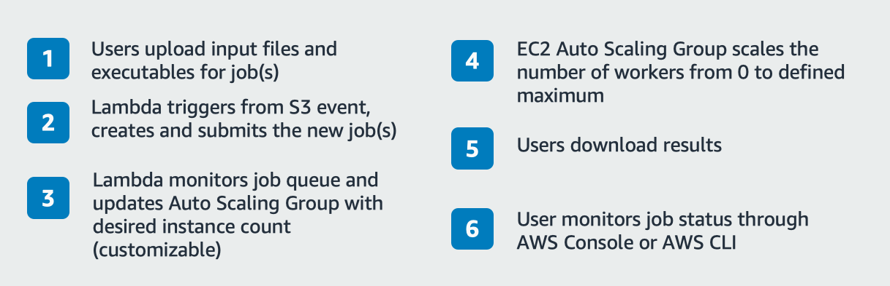
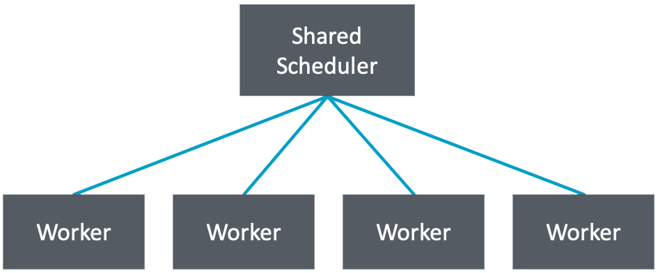
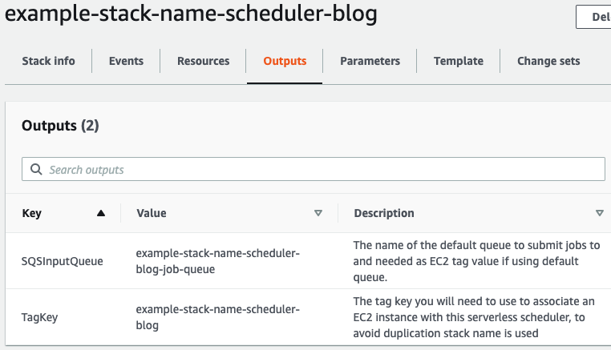

Decoupled Serverless Scheduler To Run HPC Applications At Scale on EC2
======================================================================

In this GitHub post we\'ll dive in to a cloud native approach for running
HPC applications at scale on EC2 spot, using a decoupled serverless
scheduler. This architecture is ideal for many workloads in the HPC &
EDA industries, but can be used for any batch job workload. A great
example is running IP Characterization on AWS, where the fault tolerant
nature of IP Characterization tools allows for this architecture to be
used very effectively.

After deploying, you will have a highly scalable environment that can
run on 100\'s of thousands of cores across EC2 spot instances, with a
fully serverless architecture for job orchestration. We will discuss
deploying and running a pre-built serverless job scheduler that can run
both Windows and Linux applications using any executable file format for
your application. This cloud native environment provides high
performance, scalability, cost efficiency, and fault tolerance. We will
introduce the methodology and benefits, cover the architecture, running
jobs, and integration in to existing environments.

A quick note about cloud native. Cloud native can mean a container based
environment, but here we\'re using the term more loosely to mean that we
are not replicating an on-prem environment by using a lift-and-shift
method. Instead of lift-and-shift, we\'re using AWS Services (to include
serverless and microservices) to build out our compute environment.

Let\'s get started!

What you will deploy
====================

The deployment process leverages AWS CloudFormation, that allows you to
use infrastructure as code to automatically build out your environment.
There are two parts to the solution.

**Part 1 - The Serverless Scheduler** 
--------------------------------------

This first part of the blog builds out a static compute environment,
where as in Part 2 we build an environment that leverages AWS Auto
Scaling to dynamically expand and contract your compute environment as
needed, as well as automate the job submission process. The
CloudFormation template being used for Part 1 is
serverless-scheduler-app.template, and here is the Reference
Architecture:


Figure : Serverless Scheduler Reference Architecture (greyed-out area is
covered in Part 2)

If you would like to have a detailed look at the actual Step Functions
workflow contained in the small box in Reference Architecture there is a
detailed walkthrough of each step in the GitHub ReadMe. This goes
through how the serverless application retrieves and runs jobs on its
worker, updates DynamoDB job monitoring table and manages the worker for
its lifetime.

Found here: [GitHub
Repo](https://github.com/ludvn/decoupled-serverless-scheduler)

**Part 2 - Resource Automation with Serverless Scheduler** 
-----------------------------------------------------------

This solution leverages the serverless scheduler built in Part 1, and
it allows for users to submit & monitor jobs, as well as retrieve
results. It spreads jobs across spot instances (up to 90% cheaper than
on-demand) picking the cheapest instance type available at that time and
automatically scales up compute resources when jobs are submitted and
terminates them when jobs are finished. The CloudFormation template
being used for Part 2 is resource-automation.template. Building on the
Serverless Scheduler Reference Architecture, here are the additional
resources launched with Part 2:




Figure : Resource Automation using Serverless Scheduler

Introduction to Decoupled Serverless Scheduling
===============================================

HPC schedulers traditionally run in a classic master and worker node
configuration, a scheduler on the master node orchestrates jobs on
worker nodes. This design has proven successful for decades across
numerous industries, and a number of very powerful schedulers have
evolved to meet the challenging demands of HPC workloads. This design
came out of necessity to run orchestration logic on one machine, but
there are now options to decouple this logic. What are the possible
benefits that decoupling this logic could bring? Right out of the gate
we avoid a number of shortfalls, mainly that all worker nodes need to
communicate with a single master node inherently limiting scalability
and also creating a single point of failure. The traditional scheduler
requires complex logic to manage all workers concurrently making
customisation and continues improvement of logic only possible via the
software provider\'s engineering teams.

Serverless services such as AWS Step Functions and AWS Lambda allows us
to decouple the scheduling logic to have a one-to-one mapping with each
worker and only share an Amazon Simple Queue Service (SQS) job queue
instead. We define our scheduling workflow in Step Functions and this
then scales out to potentially thousands of so called state machines
that sit as wrappers around each worker node and manages each one
individually.

We illustrate the differences between a traditional shared scheduler and
decoupled serverless scheduler in Figures 3 and 4.



Figure : Traditional Scheduler Model


Figure : Decoupled Serverless Scheduler on each instance

Each decoupled serverless scheduler will:

-   Retrieve and pass jobs to its worker

-   Monitor its workers health and take action if needed

-   Confirm job success by checking output logs and retry jobs if needed

-   Terminate the worker when job queue is empty just before also
    finishing itself

By decoupling the scheduler, complexity is reduced and at the same time
fault tolerance increases. Scalability is also increased, because jobs
are no longer dependent on a master node, and jobs can be distributed
across geographic regions to make better use of low-cost spot instances.
Additionally, customization of scheduler logic is possible by developers
who previously would not dare open up a scheduler application in an IDE.
They can for example begin making use of lower latency job monitoring
and customize automated responses to job events as they happen.

Benefits
--------

-   **Fully managed** -- All components of the scheduler are serverless
    which means no servers to spin up or manage and no incurred cost if
    you are not submitting jobs. Once this solution is deployed you can
    immediately start submitting jobs. With Part 2- Resource Automation
    also deployed, if a job is submitted, resources will launch and run
    the job. When the job is done they will automatically shut down and
    you are no longer incurring cost.

-   **Performance** -- Your application will run on EC2 and you can
    choose any of the AWS high performance instance types
    (<https://aws.amazon.com/ec2/instance-types/>). Input files are
    automatically copied from S3 into local Amazon EC2 Instance Store
    for high performance storage during execution. Result files are
    automatically moved to S3 after each job finishes.

-   **Scalability** -- You simply specify the maximum amount of nodes
    you want AWS Auto Scaling to use and the rest is done for you. The
    highly scalable and fully managed services used in this architecture
    allow you to launch thousands of jobs in parallel.

-   **Fault Tolerance** --The solution is completely decoupled, each
    worker has its own state machine that handles scheduling for that
    worker. Likewise each state machine is decoupled into lambda
    functions that make up your state machine. Adding to this, the
    scheduler workflow includes a Lambda function that confirms each
    result file and will resubmit the job if there is an issue.

-   **Cost Efficiency** -- Using EC2 Spot Instances means up to 90%
    discount compared to on-demand pricing. You can specify multiple
    instance types and AWS Auto Scaling will automatically choose the
    cheapest spot instance available at a given time. The scheduler
    workflow ensures little to no idle time of workers by closely
    monitoring and sending new jobs as one finishes. Because the
    scheduler is serverless you only incur costs when you submit a job
    and resources launch to run it, once the job finishes all resources
    are terminated automatically.

-   **Agility** - You can use AWS fully managed CI/CD pipeline services
    to quickly release changes and customize workflows. The reduced
    complexity of a decoupled scheduling workflow means developers no
    longer have to spend time managing a scheduling environment, and can
    instead focus on their applications.

Part 1 - Serverless Scheduler as a Standalone Solution
======================================================

If you use the serverless scheduler as a standalone solution you can
build clusters and leverage shared storage such as FSx for Lustre, EFS
or S3. Additionally, you can use CloudFormation or Terraform to deploy
more complex compute architectures that suit your use case. In other
words, the EC2 Instances that use the Serverless Scheduler can be
launched in any number of ways, all the scheduler requires is the
instance ID and the SQS Job Queue name. In Part 2 of this guide you
deploy an example compute resource and job submitting mechanism that
shows how you can simplify the users experience, and leverage spot
instances to drastically reduce compute costs.

Submitting Jobs Directly to Serverless Scheduler
------------------------------------------------

The serverless scheduler is a fully built AWS Step Functions workflow to
pull jobs from an SQS queue and run them on an EC2 instance. The jobs
submitted to SQS consist of an AWS Systems Manager Run command and will
work with any SSM Document and command you which to use to run your
jobs. Examples of SSM Run Commands are bash and PowerShell. You can read
more on SSM Run Commands on [Running Commands Using Systems Manager Run
Command](https://docs.aws.amazon.com/systems-manager/latest/userguide/execute-remote-commands.html).

The format of a job submitted to SQS is in json, and can be seen in the
example below:
```
{

    "job_id": "jobId_0",

    "retry": "3",

    "job_success_string": " ",

    "ssm_document": "AWS-RunPowerShellScript",

    "commands":

        [

            "cd C:\\ProgramData\\Amazon\\SSM",

            "Copy-S3object -Bucket my-bucket -KeyPrefix jobs/date/jobId_0
            -LocalFolder .\\\\\",

            "C:\\ProgramData\\Amazon\\SSM\\jobId_0.bat",

            "Write-S3object -Bucket my-bucket -KeyPrefix jobs/date/jobId_0
            --Folder .\\"

        ],

}
```
Any EC2 instance that has a serverless scheduler associated with it will
receive jobs picked up from a designated SQS queue until the queue is
empty. After that the EC2 resource will automatically be terminated. If
the job fails it will be retried the number of times you specify in the
job definition. You can optionally include a specific string value you
would like the scheduler to look for in the job execution output in
order to confirm a job has actually completed successfully.

Tagging EC2 Workers to Get a Serverless Scheduler State Machine
---------------------------------------------------------------

In Part 1 of the deployment, you will need to manage your EC2 instance
launch and termination. When you launch an EC2 instance you will tag it
with a specific tag key which will trigger a state machine to manage
that instance. The tag value is the name of the SQS queue you would like
your state machine to poll jobs from.

In example tag below, \"my-scheduler-cloudformation-stack-name\" is the
tag key deployed with the scheduler it will look for in EC2. Next,
\"my-sqs-job-queue-name\" is the default job queue created with the
scheduler but you can change this to any queue name you want to retrive
jobs from when an instance is launched.

{"my-scheduler-cloudformation-stack-name":"my-sqs-job-queue-name"}

Monitor Jobs in DynamoDB
------------------------

You can monitor job status via the DynamoDB table as shown below. In the
table you can find job_id, commands sent to EC2, job status, job output
logs from EC2 and retries among other things.


Alternatively users can query DynamoDB for a given job\_id via the AWS
CLI:

```
aws dynamodb get-item --table-name job-monitoring --key '{"job_id": {"S": "/my-jobs/my-job-id.bat"}}'
```

How to Use "job_success_string" Parameter
-----------------------------------------
For the DynamoDB table above I submitted two identical jobs using an
example script you can use as well. The command sent to the instance is
"echo Hello World" where the output from this job should be "Hello
World". I also specified 3 allowed job retries. Here are the two jobs in
SQS queue before they ran, look closely at the different
"job\_success\_strings" for each and the identical command sent to both:


We see in DynamodDB table that one Job2 was successful and Job1 retried
3 times before permanently labelled failed. I purposely forced this to
show how the job success string works by submitting Job1 with
\"job\_success\_string\" as \"Hello EVERYONE\" as that will not be in
the job output "Hello World". In "Job2" I set \"job\_success\_string\"
as \"Hello\" because I know this string will be in the output log.

Job outputs will commonly have some manner of text that only appears if
job did what it should or you can add it yourself in your executable
file. With "job\_success\_string" you can be confident a successful job
was indeed successful or use it to identify a certain value you are
looking for across many jobs.

Part 2 - Resource Automation with the Serverless Scheduler
==========================================================

The additional services we deploy in Part 2 are an example integrating
existing architectures that will launch resources for your serverless
scheduler. We deploy additional services that allow users to submit jobs
simply by uploading input files and executable files to an S3 bucket.

Likewise they can use any executable file format they want, including
proprietary application level scripts. The solution automates everything
else including composing and submitting jobs to SQS job queue, and
spinning up compute resources when new jobs come in and taking them back
down when there are no jobs to run. When jobs are done result files are
copied to S3 for the user to retrieve. Similar to Part 1, users can
still view the DynamoDB table for job status.

This architecture makes it easy to scale out to different teams and
departments, and users can submit potentially 100s of thousands of jobs
while you remain in control of resources and cost.

Deeper Look at Resource Management Architecture
----------------------------------

The diagram below shows how users can submit jobs, monitor progress and
retrieve results. A user will upload all needed input files and an
executable script to run their job on EC2. **It is the suffix of the
executable file (uploaded last) that triggers an S3 event to start the
process, and this suffix is configurable.** The S3 key of the executable
file acts as the job id and will be kept as a reference to that job in
DynamoDB. The Lambda (\#2 in diagram below) uses the S3 key of the
executable to create three SSM Run Commands, first synchronise all files
in the same S3 directory to a working directory on the EC2 instance,
then run the executable file on EC2, and finally synchronise the EC2
working directory back to the S3 bucket where newly generated result
files will be included. This Lambda (\#2) then places job on the SQS
queue using the schedulers json formatted job definition seen above.

*IMPORTANT: Each set of job files should be given a unique job folder*
*in S3 or more files than needed might be moved to EC2.*


Figure : Resource Automation using Serverless Scheduler - A deeper look

Using both the Lambda function (\#3 in diagram above) and the Auto
Scaling Group, Amazon EC2 and "AWS Step Functions workflow" will scale
out based on how many jobs are in the job queue to a desired maximum
number of workers (plus state machine) defined in the Auto Scaling
Group. When the job queue is empty the number of running instances will
progressively scale down to 0 as they finish their remaining jobs.

Process Submitting Jobs & Retrieving Results
--------------------------------------------

1.  Seen as step 1 above, users upload input file(s) and an executable
    file into a unique job folder in S3 (such as
    /year/month/day/jobid/~job-files). Users upload the executable file
    last as this will automatically start the job. Users can also use a
    script to upload multiple files at a time but each job will need a
    unique directory. There are many ways to make S3 buckets available
    to users including Storage Gateway, AWS Transfer, AWS DataSync, AWS
    Console or any one of the AWS SDKs leveraging the S3 APIs.

2.  Users can monitor job status by accessing the DynamoDB table
    directly via the console or use the AWS CLI to call DynamoDB via an
    API call.

3.  Seen as step 5 above, users can retrieve result files for their jobs
    from the same S3 directory where they left the input files. Users
    know jobs are done by monitoring DynamoDB table. The SQS output
    queue can also be used by applications that need to automatically
    poll and retrieve results.

Users no longer create or access compute nodes as compute resources
automatically scale up from zero when jobs come in, and then back down
to zero when jobs are finished.

Deeper Look at Serverless Scheduler Workflow
--------------------------------------------


1.  For a new EC2 instance with tag-key "my-scheduler-cloudformation-stack-name" Lambda starts a
    state machine and passes it the instnace id and SQS queue job name
    (#4 in previous architecture). The workflow waits for instance to
    be ready to start running jobs. If something fails, this step goes
    to step 8 and terminates instance.

2.  Workflow polls SQS job queue for new job. Message contains job_id,
    number of retries, optional success string to look for in job output
    logs and finally the SSM document type and commands to run/trigger
    that job on EC2.

3.  Using SSM Run Command, the job is passed to EC2 instance.

4.  Job start is written to DynamoDB

5.  Here the workflow will wait for commands to finish by polling SSM
    Run command for status.

6.  This step looks for a specific string in the job execution output to
    confirm the job ran successfully. You can leave it as blank to
    confirm any output. If job success is confirmed, workflow moves to
    step 6.1, if not flow moves to 6.2. Job status is written to
    DynamoDB. Finished job is then added to SQS Finished Job queue as
    potential on-premise system integration point to retrive results. If
    failed, job gets added back to job queue to run again if there are
    retry attempts remaining. A job will retry the number of times you
    specify in job definition.

7.  This steps checks if there are any jobs left in the job input queue.
    If there are more jobs then workflow goes back up to step 2 to start
    a new job and run steps 2 -- 6 again. Else, workflow moves to
    step 8.

8.  This step is reached if all job queue is empty or if there was an
    issue with the EC2 instance. First scale-in protection is removed in
    the EC2 Autoscaling Group if Autoscaling is in use. After that the
    workflow will terminate the instance automatically so users don't
    need to worry about idle instances.

Deployment
==========

Deploy Part 1: the Serverless Scheduler Using CloudFormation Template
---------------------------------------------------------------------

Now that we have an understanding of how the Serverless Scheduler works,
and we also understand how we extend that to enable automation and Auto
Scaling, let launch the environments.

Open the following template in AWS CloudFormation [Deploy Serverless
Scheduler](https://github.com/ludvn/decoupled-serverless-scheduler/blob/master/serverless-scheduler-app.template).
As seen below you will need to give the stack a name, this name is used
for all resources created including the S3 bucket. This means that the
stack name will have to adhere to the S3 bucket name rules. Please see
[Bucket Restrictions and
Limitations](https://docs.aws.amazon.com/AmazonS3/latest/dev/BucketRestrictions.html).
Make the name as unique as possible to avoid issues. Feel free to add
tags on next page to track costs in AWS Cost Explorer, otherwise you
don't need to specify any other fields.


The stack name you give when deploying this template is important as it
becomes the tag key you will need to give EC2 workers in order to assign
them a scheduler state machine when running jobs. You can find the tag
key in the Output tab of your CloudFormation stack. Make note of this
name for later as you will need to specify this when deploying Part 2 of
this workshop. You will not need SQSInputQueue name as key value since
Part 2 creates its own job queue and uses that name as the key value
automatically.



Or Clone Repository and Deploy via Template ***(Optional)***
------------------------------------------------------------

For more advanced users who want to tailor this solution to their own
needs, clone the repo from git and deploy via AWS CLI or AWS SAM CLI as
shown below. Setup your own CI/CD pipeline with AWS managed services or
use your own CI/CD pipeline to operationalise continues improvement of
your job environments.

1.  Run a git clone of repository
```
git clone <https://github.com/ludvn/decoupled-serverless-scheduler>
```
2.  Use AWS SAM to build and deploy your application
```
#Step 1 - Make sure that the Region for this bucket aligns with where
you deploy

aws s3 mb s3://bucketname --region region # Example regions: us-east-1, ap-east-1, eu-central-1, sa-east-1

#Step 2 - Package SAM and upload to your S3 bucket

aws cloudformation package --template-file
serverless-scheduler-app.template --output-template
package-scheduler.yaml --s3-bucket bucketname

#Step 3 - Deploy your application

aws cloudformation deploy --template-file .\\package-scheduler.yaml
--stack-name serverless-scheduler --capabilities CAPABILITY_IAM
CAPABILITY_NAMED_IAM
```

Deploy Part 2: Resource Automation using Serverless Scheduler
-------------------------------------------------------------

To deploy this solution and run the example case is quick and simple as
you are provided a CloudFormation template that will build everything
for you. You will then want to customise it to run your own application
(Windows or Linux). All you will need to do is create an Amazon Machine
Image with your application installed and add this new AMI ID to the
Autoscaling group created when you ran the CloudFormation template.
Finally make sure your S3 bucket is setup to trigger an event from your
apps executable file type (such as .bash, .bat, .ps or application
specific scripts).

Descriptions in template contains instructions to deploy this template
correctly. You will need the stack name from your previously deployed
serverless-scheduler-app.

**Run CloudFormation Template** - [Deploy Resource Automation using
Serverless
Scheduler](https://github.com/ludvn/decoupled-serverless-scheduler/blob/master/burst-to-cloud.template)

Once you have run a test case as described below and feel comfortable
with the solution add your own Amazon Machine Image (AMI) and choose
what range of instance types you would like your app to run on. More on
how to do this in below section "Add Your Own Application".

Execute a Test Run With the Example case
----------------------------------------

### Submit One Job Manually

The easiest way to run a test is to create a new job folder in your S3
bucket and simply upload an example input file and executable file,
default deployment has the S3 Event Trigger set to \".bat\" but you can
change the S3 trigger suffix to whatever file suffix needed for your
executable.

*IMPORTANT: Each set of job files should be given a unique job directory
so in this case create a new folder first in bucket such as
"bucket/example_job/" and upload files to that folder. This is a good
precautionary measure to always follow avoiding more files than needed
being copied to EC2.*

You can download this example .bat file as an executable [Example
Executable
File](https://github.com/ludvn/decoupled-serverless-scheduler/blob/master/package-compute-resource.yml).
By dropping this in your S3 bucket with any other file it will perform
an example copy operation on EC2 and pass back a file with a new name
imitating a job that generates a result file.

### Submit Multiple Jobs at Once With Python Script

The following python script shows how you can automate sending thousands
of jobs at once and includes the example case above. I would recommend
sending 1 job, checking your setup is correct in SQS, Autoscaling, Step
Functions and DynamoDB i and if so go crazy and send a lot more!
```
import boto3

import datetime

s3_r = boto3.resource('s3')

now = datetime.datetime.now().strftime("%y-%m-%d")

# This script sends new jobs to scheduler by uploading the job input
files and executable file to s3 bucket

# A unique S3 directory should be used for each job to specify what
files need to be copied to working directory on EC2 instance store

# An S3 event will need to exist to trigger S3Trigger.py Lambda on
executable file suffix, in this case ".bat".

# Output files from jobs will be copied back to this directory from the EC2 working directory

bucket = 'my-burst-to-cloud-bucket' #NEEDS UPDATING - Enter your bucket name

for i in range(0, 500, 1): #NEEDS UPDATING - The number of loops is how
many test jobs to send

    jobid = 'jobId_' + str(i)

    key = 'jobs/' + now + '/' + jobid + '/' + jobid + '.def'
    #Creates a unique S3 key for each job

    #NEEDS UPDATING - local file to send

    s3_r.meta.client.upload_file(Filename=".\\local_folder\\CFD_Job.def",
    Bucket=bucket, Key=key)

    key = 'jobs/' + now + '/' + jobid + '/' + jobid + '.bat' # When
    S3 Trigger is ".bat" suffix

    #Here I specify what to put in executable .bat file

    content = "copy C:\\ProgramData\\Amazon\\SSM\\{}.def
    C:\\ProgramData\\Amazon\\SSM\\Result\\{}.res".format(jobid,
    jobid)

    s3_r.Object(bucket, key).put(Body=content) #send executable file to s3

    print(key+ '-----' + content)
```

Add Your Own Application
------------------------

You will now want to get this working with your own applications and job
executables to run EDA, CFD, FEA or whatever application you might be
using, Windows or Linux. To do this you simply need to create an Amazon
Machine Image (AMI) with the application you are using on it. You can
then go to your CloudFormation Stack and update the AMI ID and then
deploy this update. Alternatively go straight to the Autoscaling Group
configuration and change the AMI ID.

The following AWS Guide shows you how to create an Amazon Machine Image:
[Create an AMI from an Amazon EC2
Instance](https://docs.aws.amazon.com/toolkit-for-visual-studio/latest/user-guide/tkv-create-ami-from-instance.html)

Next you will want to choose what range of instance types to use for
your spot instance workers. By choosing a range AWS Autoscaling will
pick an instance type based on allocation strategy, the default is
lowest cost allocation. When you first deploy the template it has some
default instance types in the t2 range which are small instances and not
suitable for most HPC applications.

To change instance types navigate in the AWS console to your Autoscaling
Group called "your-stack-name-autoscaling-group" and from the "Actions"
drop-down menu select "Edit". Change current configuration to the
instance types you want to use. You can read about available types here:
[AWS EC2 Instance Types](https://aws.amazon.com/ec2/instance-types/).


You can now start submitting your own input files and executable scripts
to S3 to run jobs!

Additional Points on Usage Patterns
===================================

-   While the two solutions in this blog are aimed at HPC applications
    they can be used effectively to run any batch jobs. For example, I
    have many customers that run large data processing batch jobs in
    their data lakes and could use the serverless scheduler for this.

-   You can look to build pipelines of different applications where the
    output of one job triggers another to do something else, example
    being pre-processing, meshing, simulation, post-processing. All you
    need to do is deploy the Resource Automation template several times
    and tailor it so that the output bucket for one step is the input
    bucket for the next step.

-   Customers might look to use the "job\_success\_string" parameter for
    iteration/verification used cases where a shot-gun approach is
    needed running thousands of jobs and only one has a chance of
    producing the right result. In this case the "job\_success\_string"
    would identify the successful job from potentially 100s of thousands
    pushed to SQS job queue.

Scale-out Across Teams & Departments
------------------------------------

You can deploy as many run environments as needed without increasing
overall costs. All services used are serverless meaning they will only
accumulate cost when they are actually used. You can deploy ten job
environments and run one job in each and your costs would be the same if
you had one job environment and ran 10 jobs there.

All a user, team or department need is an S3 bucket to upload jobs to
and an associated AMI that has the right applications and license
configurations on it. Because job configurations are passed to the
scheduler at each job start you could even add new teams by just
creating an S3 bucket and pointing S3 events to a default Lambda
function that will pull configurations for each job at start.

Setup CI/CD Pipeline to Start Continuous Improvement of Scheduler
-----------------------------------------------------------------

I would encourage advanced users to clone the git repo and begin
improving and customising this solution to fit their particular needs.
The serverless scheduler is much less complex than your typical
scheduler because you only need to think about one worker and it comes
down to get job and run job over and over.

Ways you could tailor this solution:

-   **Add intelligent job scheduling using AWS Sagemaker** - Its hard to
    find data as clean and ready for machine learning as log data, in
    this case every job you run will have different run time and
    resource consumption depending on the job metadata and instance type
    you use so why not predict the best instance to use with machine
    learning at the time of job submission.

-   **Add Custom Licensing Checkout Logic** -- All it would take is one
    Lambda added to your Step Functions workflow to make an API call to
    a license server before continuing with one or more jobs. You can
    either start a new worker only when you have a license checked out
    or if a license is not available then the instance can
    terminate/shut-down to remove any costs waiting for licenses.

-   **Add Custom Metrics to DynamoDB** -- You already have a baseline
    logging and monitoring capability with the solution pushing to
    DynamoDB and so adding additional metrics is easy.

-   **Run on other AWS Services** -- You will find a Lambda function in
    the Step Functions workflow called "Start\_Job". You can tailor this
    Lambda to simply run your jobs on AWS Sagemaker, AWS EMR, AWS EKS or
    AWS ECS instead of EC2.

Conclusion
==========

Although HPC workloads and EDA flows may still be dependent on current,
existing scheduling technologies, hopefully we have illustrated the
possibilities of decoupling your workloads from your existing shared
scheduling environment. We have gone very deep on decoupled serverless
scheduling and we understand that it is no small task to unwind decades
of dependencies. That said, leveraging the numerous AWS Services
encourages customers to think completely differently about running
workloads, but more importantly, it allows for customers to Think Big.
Rather than worrying about the constraints of on-premises installations
and the fear of failing, you can be up and running in a short time, fail
fast and move on to the next iteration. All this while scaling to the
number of resources you require, when you want it, and you only pay for
what you use.

Serverless computing will continue to be a change catalyst across all
industries, but maybe not as apparent as in the HPC and EDA industries.
As this is where customers can really take advantage of the nearly
limitless capacity that AWS has to offer.

Please don\'t hesitate to reach out for questions about HPC and EDA on
AWS. You now have the architecture and the instructions to build your
Serverless Decoupled Scheduling environment. Go build!

Future
======

-   Shared Storage Options ( Amazon FSx for Lustre, EFS)

-   Add Intelligent Job Scheduling Using AWS Sagemaker for Machine
    Learning

-   Customize Monitoring Parameters in DynamoDB

-   Licensing Checkout Logic
